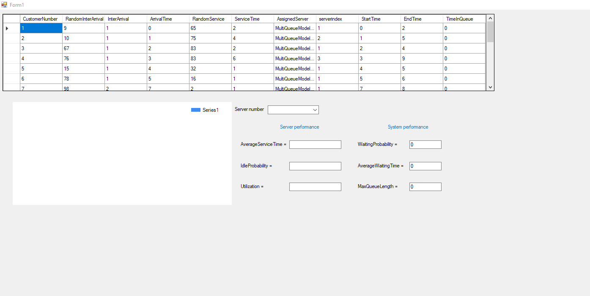
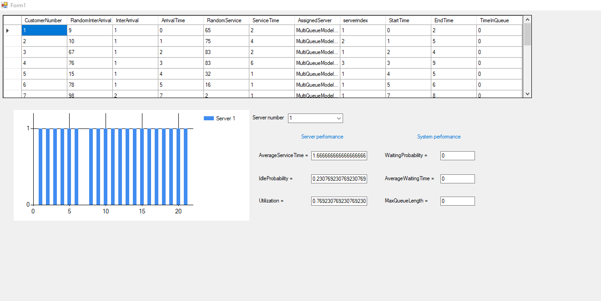
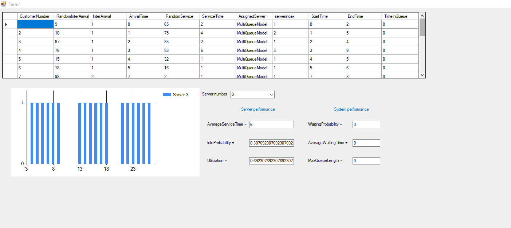
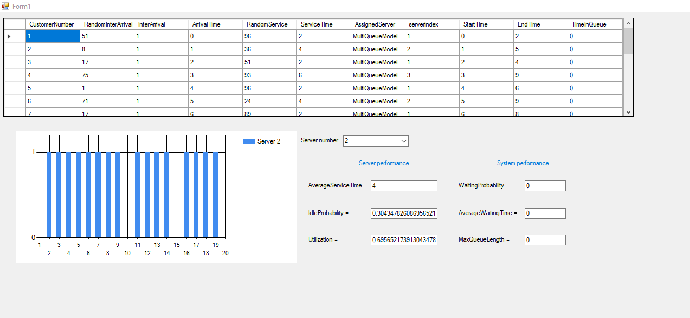

# Multi Queue Simulation System

## Windows Form Simulation System For Call Center Department Using ASP.Net Core 4.8

# Features

### The System has many servers each and system use the server based on different criteries

#### 1- Random (choose Server Randomly)

#### 2- Highest Priority (Choose the Highest Priority Server when different servers are avaliable)

#### 3- Least Utilization

### System Calculate different performance probabilities

#### 1- For Each Server

##### Average Service Time

##### Idle Probability

##### Utilization

#### For System

##### Waiting Probability

##### Average Waiting Time

##### Max Queue Length

## ScreenShotes For Run

</img>
</img>
</img>
</img>
